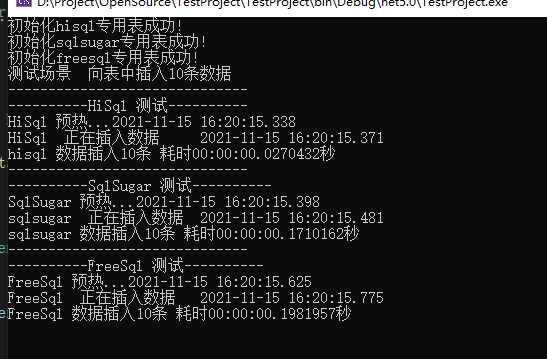
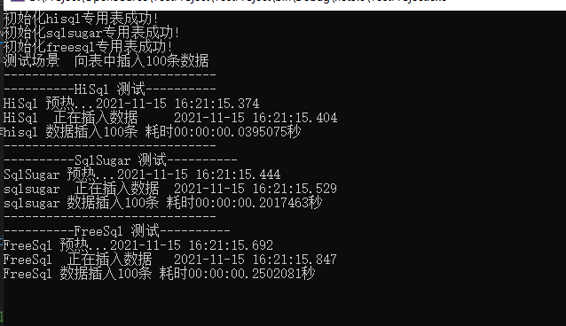
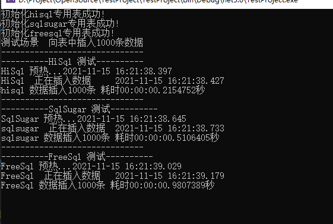
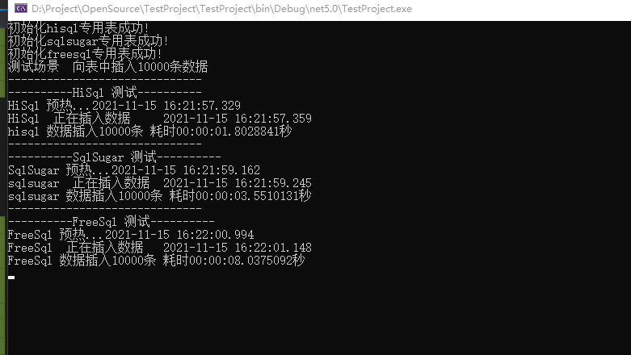
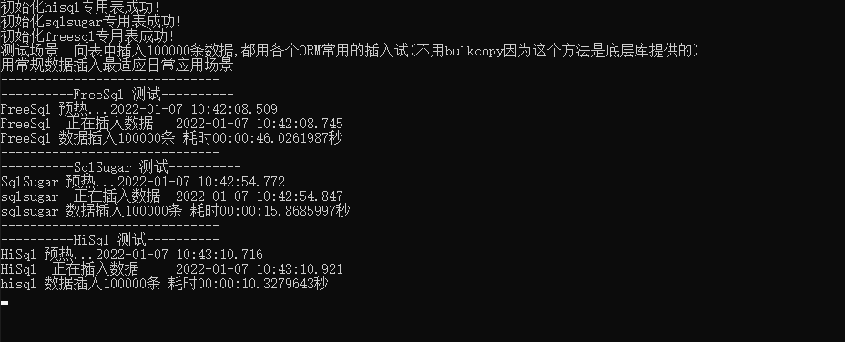

# hisql与目前比较流行的ORM框架性能测试对比


## 总体测试结果

|   插入记录数    |      hisql(耗时)      |      sqlsugar(耗时)       |      freesql(耗时)       |
|--------------------|----------------------|----------------------|----------------------|
| 10条       | `0.0270秒`                  |`0.1710秒`                  |`0.1981秒`                  |
| 100条 | `0.0395秒`                  |`0.2017秒`                  |`0.2502秒`                  |
| 1000条 | `0.2154秒`                  |`0.5106秒`                  |`0.9807秒`                  |
| 10000条   | `1.8028秒`                  |`3.5510秒`                  |`8.0375秒`                  |
| 100000条   | `16.9936秒`                  |`33.2747秒`                  |`77.9188秒`                  |


从测试结果来看 HiSql的性能测试名列前茅

hisql源码下载
```cmd
git clone https://github.com/tansar/HiSql.git
```


## hisql sqlsugar freesql 插入10条数据测试


## hisql sqlsugar freesql 插入100条数据测试



## hisql sqlsugar freesql 插入1000条数据测试


## hisql sqlsugar freesql 插入10000条数据测试


## hisql sqlsugar freesql 插入100000条数据测试
