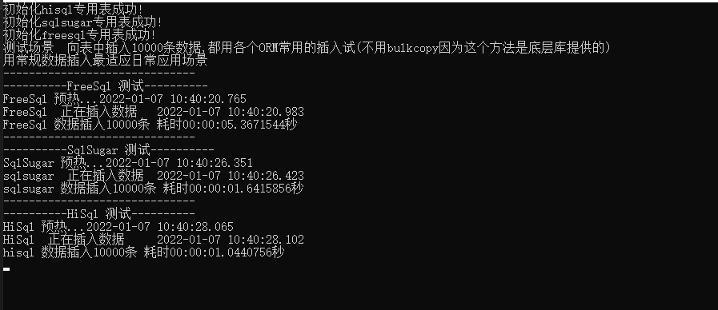
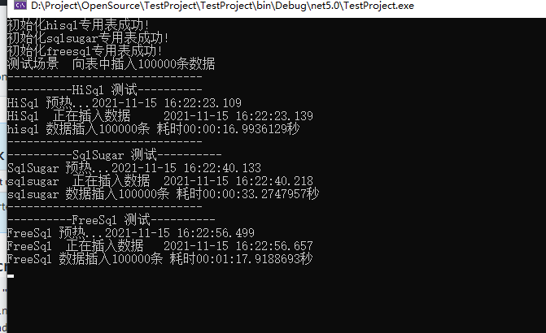

# hisql与目前比较流行的ORM框架性能测试对比


## 总体测试结果

|   插入记录数    |      hisql(耗时)      |      sqlsugar(耗时)       |      freesql(耗时)       |
|--------------------|----------------------|----------------------|----------------------|
| 5条       | `0.0107秒`                  |`0.0312秒`                  |`0.02675秒`                  |
| 10条       | `0.0111秒`                  |`0.0307秒`                  |`0.0271秒`                  |
| 50条 | `0.0174秒`                  |`0.0364秒`                  |`0.0430秒`                  |
| 100条 | `0.0281秒`                  |`0.0472秒`                  |`0.0922秒`                  |
| 200条 | `0.0310秒`                  |`0.0584秒`                  |`0.2319秒`                  |
| 500条 | `0.0712秒`                  |`0.1127秒`                  |`0.5996秒`                  |
| 1000条 | `0.1112秒`                  |`0.1871秒`                  |`0.8145秒`                  |
| 10000条   | `1.0440秒`                  |`1.6415秒`                  |`5.3671秒`                  |
| 100000条   | `10.3279秒`                  |`15.8685秒`                  |`46.0261秒`                  |


### 分析
1. 5条数据时 HiSql比SqlSugar快2.91倍 比freesql快2.5倍,从数据可以看得出在这个数据档位sqlsugar表现是慢的 freesql比sqlsugar快14%

2. 10条数量测试三个ORM的线性变化值不大 依然是hisql最快 freesql次之,sqlsugar相对比freesql慢一点
   
3. 50条数据时 hisql比sqlsugar快2.09倍 比freesql快2.47倍 ，此时sqlsugar比freesql快18%,可以看出freesql在数量增长时他的性能也是呈下滑趋势
4. 100条数据时 hisql比sqlsugar快1.67倍 比freesql快3.28倍，sqlsugar比freesql快1.95倍,sqlsugar与Hisql差距慢慢在缩小，但freesql与其它两个orm框架相比差距越来越大
5. 当数据达到100000条时 hisql依然比sqlsugar保持在绝对性的优势


从测试结果来看 HiSql的性能测试名列前茅 sqlsugar次之 freesql表现最差

 [HiSql 源码(github) https://github.com/tansar/HiSql](https://github.com/tansar/HiSql)
```cmd
git clone https://github.com/tansar/HiSql.git
```

 [HiSql 源码(github) https://github.com/tansar/HiSqlTestDemo](https://github.com/tansar/HiSqlTestDemo)
```shell
git clone https://github.com/tansar/HiSqlTestDemo.git
```


## hisql sqlsugar freesql 插入5条数据测试


## hisql sqlsugar freesql 插入10条数据测试


## hisql sqlsugar freesql 插入50条数据测试


## hisql sqlsugar freesql 插入100条数据测试


## hisql sqlsugar freesql 插入100条数据测试


## hisql sqlsugar freesql 插入1000条数据测试


## hisql sqlsugar freesql 插入10000条数据测试


## hisql sqlsugar freesql 插入100000条数据测试



后续请关注bulkcopy的性能测试对比